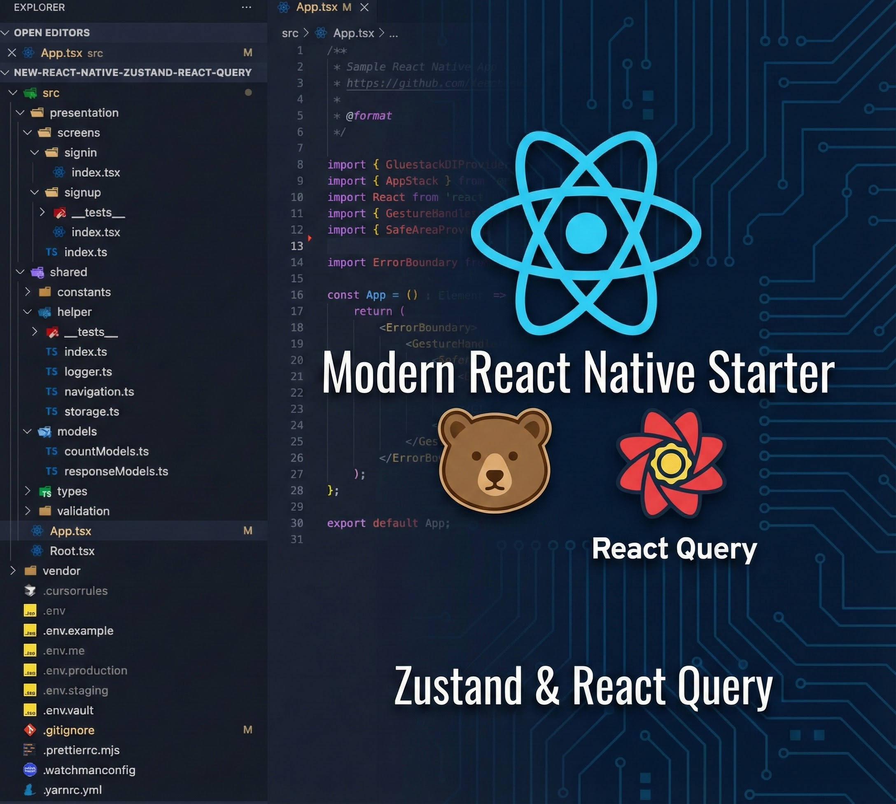

<div>
  <h1>🚀 React Native Modern Architecture</h1>
  <p align="center">
    
  </p>
  <p>A modern React Native boilerplate with Zustand, React Query and best practices</p>
  <p><strong>Create a new project using our CLI: <a href="https://github.com/linhnguyen-gt/create-rn-project">create-rn-project</a></strong></p>

  <p>
    <a href="https://reactnative.dev/" target="_blank">
      
    </a>
    <a href="https://www.typescriptlang.org/" target="_blank">
      
    </a>
  </p>

### Core Libraries

  <p>
    
    
    
  </p>

### State Management & API

  <p>
    
    
    
  </p>

### UI & Styling

  <p>
    
    
    
  </p>

### Form & Validation

  <p>
    
    
  </p>

### Development & Testing

  <p>
    
    
    
  </p>

### Environment & Storage

  <p>
    
    
    
  </p>

### Development Tools

  <p>
    
    
  </p>

### Environment Support

  <p>
    
    
  </p>
</div>

## Key Features

### Architecture & State Management

- **Well-organized Architecture** with clear separation of concerns:
    - Presentation Layer (UI/Screens/Hooks)
    - Application Layer (State Management)
    - Data Layer (API/Storage)
    - Shared (Models/Utilities)
- **Modern State Management**
    - Zustand for client-side state
    - React Query for server-side state
    - Async Storage for persistence

### Development Experience

- TypeScript for type safety
- Cross-platform (iOS & Android)
- NativeWind & Tailwind CSS for styling
- Jest setup for testing
- ESLint & Prettier configuration

### UI & Components

- Gluestack UI components
- Responsive design patterns
- Custom hooks and components
- Form handling with react-hook-form & zod

### Environment & Configuration

- Multi-environment support (Dev/Staging/Prod)
- Expo-native environment variable management
- Native iOS schemes and Android flavors generated by Expo prebuild
- Version management system

## Architecture Overview

The project follows a simplified but well-organized architecture to maintain:

- Separation of concerns
- Modularity
- Testability
- Maintainability

### Layer Responsibilities

1. **Presentation Layer** (`src/presentation/`)
    - UI Components
    - Screens
    - Navigation
    - Hooks for data access

2. **Application Layer** (`src/app/`)
    - State Management (Zustand stores)
    - Application-wide providers

3. **Data Layer** (`src/data/`)
    - API services
    - HTTP client
    - Storage services
    - External service integrations

4. **Shared Layer** (`src/shared/`)
    - Models
    - Types
    - Constants
    - Utility functions

## Quick Start

### Prerequisites

Make sure you have the following installed:

- Node.js (v22.11.0+)
- pnpm (v10.33.0, via Corepack)
- React Native CLI
- Xcode (for iOS)
- Android Studio (for Android)
- Ruby (>= 2.6.10)
- CocoaPods

### Installation

### Clone the repository\*\*

```bash
git clone https://github.com/linhnguyen-gt/new-react-native-zustand-react-query
cd new-react-native-zustand-react-query
corepack enable
pnpm install
```

## Environment Configuration

### Setup Environment

First, you need to run the environment setup script:

```bash
pnpm env:setup
```

This script will:

1. Set up dotenv-vault (optional)
2. Create environment files for all environments:
    - `.env` (Development environment)
    - `.env.staging` (Staging environment)
    - `.env.production` (Production environment)
3. Configure necessary environment variables

### Environment Files Structure

Each environment file contains:

```bash
# Required Variables
APP_VARIANT=development|staging|production
VERSION_CODE=1
VERSION_NAME=1.0.0
API_URL=https://api.example.com

# Optional legacy alias during migration
APP_FLAVOR=development|staging|production

# Optional Variables (configured during setup)
GOOGLE_API_KEY=
FACEBOOK_APP_ID=
# ... other variables
```

### Using Different Environments

```bash
# Development (default)
pnpm android
pnpm ios

# Staging
pnpm android:stg
pnpm ios:stg

# Production
pnpm android:prod
pnpm ios:prod
```

### Expo-native Environment Workflow

This boilerplate uses Expo dynamic config as the source of truth for environments, then generates native variants during prebuild.

- `APP_VARIANT=development|staging|production` selects the variant.
- `app.config.ts` maps each variant to bundle/package identifiers, display name, version fields, and OTA metadata.
- `plugins/with-environment-support.cjs` generates Android product flavors and iOS shared schemes.
- `pnpm native:sync-env` syncs native display names from `APP_NAME` in `.env*` into generated Android/iOS projects.
- JS runtime reads values from `expo-constants` through `src/shared/config/appConfig.ts`.
- `expo prebuild --clean` is reproducible and only needs to run when native output should be regenerated.

#### Variant Mapping

| Variant       | iOS scheme                 | iOS configuration                         | iOS bundle ID                      | Android variant                           | Android package                    |
| ------------- | -------------------------- | ----------------------------------------- | ---------------------------------- | ----------------------------------------- | ---------------------------------- |
| `development` | `NewReactNativeZustandRNQ` | `Debug` / `Release`                       | `com.newreactnativezustandrnq.dev` | `developmentDebug` / `developmentRelease` | `com.newreactnativezustandrnq.dev` |
| `staging`     | `Staging`                  | `Staging.Debug` / `Staging.Release`       | `com.newreactnativezustandrnq.stg` | `stagingDebug` / `stagingRelease`         | `com.newreactnativezustandrnq.stg` |
| `production`  | `Production`               | `Production.Debug` / `Production.Release` | `com.newreactnativezustandrnq`     | `productionDebug` / `productionRelease`   | `com.newreactnativezustandrnq`     |

#### Commands

```bash
# Run native builds
pnpm android
pnpm android:stg
pnpm android:prod
pnpm ios
pnpm ios:stg
pnpm ios:prod

# Regenerate native folders from Expo config
pnpm prebuild:clean

# Sync APP_NAME into generated native projects without prebuild
pnpm native:sync-env
```

#### IDE Builds

- Xcode: open `ios/NewReactNativeZustandRNQ.xcworkspace`; the default `NewReactNativeZustandRNQ` scheme is development, and `Staging` / `Production` are explicit environment schemes.
- Android Studio: open `android`, then choose `developmentDebug`, `stagingDebug`, or `productionDebug` from Build Variants.
- Native build settings set `APP_VARIANT` and `ENVFILE`, so switching environment in the IDE does not require another prebuild.
- If you change `APP_NAME` and build directly from Xcode or Android Studio, run `pnpm native:sync-env` first. The `pnpm ios*` and `pnpm android*` scripts already run it automatically.

#### Runtime Access

```ts
import { appConfig } from '@/shared/config/appConfig';

appConfig.variant;
appConfig.appName;
appConfig.versionName;
appConfig.versionCode;
appConfig.apiUrl;
```

#### Notes

- Keep `.env`, `.env.staging`, `.env.production` as the local variable sources.
- Run `pnpm native:sync-env` after changing `APP_NAME`.
- Run `pnpm prebuild:clean` after changing native-facing values such as `VERSION_CODE`, `VERSION_NAME`, bundle IDs, package IDs, icons, splash assets, or plugin config.
- `APP_FLAVOR` is still tolerated as a legacy alias during migration, but new scripts use `APP_VARIANT`.
- `react-native-config` is no longer part of the build path; native variant wiring is generated by the Expo config plugin.
- `ios/Podfile` still contains the string `react-native-config`, but only as the Expo autolinking subcommand name, not as a dependency.
- App icon and splash source assets now live in `assets/branding/` and are regenerated during `expo prebuild --clean`.

### Native Customization Notes

`ios/` and `android/` are generated by Expo prebuild. Manual edits inside those folders can be lost after `pnpm prebuild:clean`.

Use these locations for durable native customization:

- Native configuration changes: add or update a config plugin in `plugins/`.
- Native Swift/Kotlin bridge code: create a local Expo module under `modules/`.
- App icon and splash source files: update `assets/branding/`.

If a native change must survive a clean prebuild, do not leave it only as a direct edit in generated native folders.

## Project Structure

- `src/app/`: providers and Zustand stores
- `src/data/`: API, React Query, and infrastructure services
- `src/presentation/`: screens, navigation, hooks, and reusable UI
- `src/shared/`: constants, models, types, and utilities
- `plugins/`: Expo config plugins for reproducible native project generation
- `assets/branding/`: source app icon and splash assets

## Development Tools

For Android debugging with Reactotron, run `pnpm adb:reactotron`.

## Code Style

Use ESLint, TypeScript, Jest, and Prettier:

```bash
pnpm lint
pnpm lint:tsc
pnpm test
pnpm lint:fix
```

For native config/plugin changes, also verify regeneration:

```bash
pnpm prebuild:clean
```
